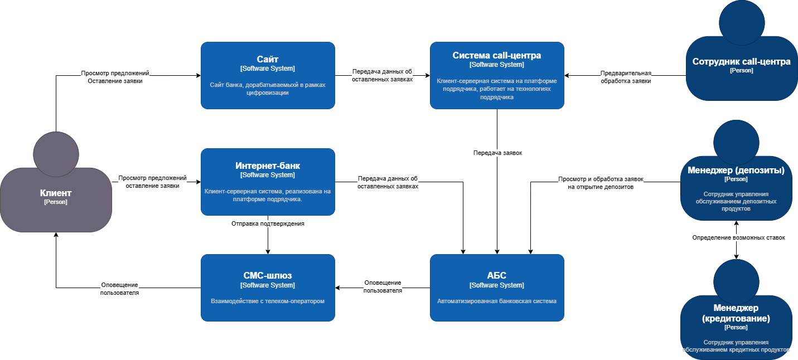
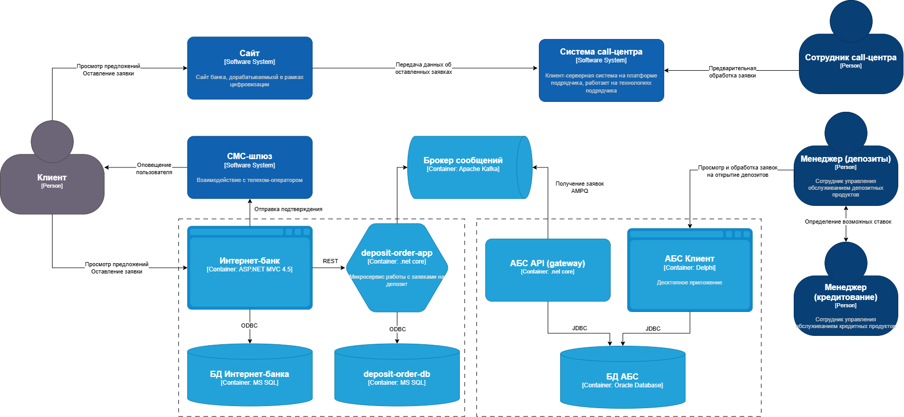

### **Название задачи: Открытие депозитов онлайн** 
### **Автор: -**
### **Дата: 22.06.2025**
### **Функциональные требования**

|**№**|**Действующие лица или системы**|**Use Case**|**Описание**|
| :-: | :- | :- | :- |
| UC1 | Клиент  Сайт  Система call-центра  Сотрудник call-центра  АБС  | Заявка на открытие депозита через сайт          | 1. На сайте новый клиент видит список доступных депозитов с актуальными ставками.  2. Клиент может подать заявку на депозит, оставив свой номер телефона и ФИО  3. После этого ему позвонит менеджер call-центра. Изучив заявку в системе call-центра, менеджер может предложить особые условия.  4. При подтверждении заявки она передается в АБС. |
| UC2 | Клиент  Интернет-банк  СМС-шлюз  АБС  | Заявка на открытие депозита через интернет-банк | 1. В интернет-банке клиент видит список доступных депозитов с актуальными ставками и персонализированные ставки лично для него.  2. Указав счет и сумму депозита, он может подать заявку на открытие депозита.  3. Операцию будет необходимо подтвердить с помощью СМС-кода.  4. При подтверждении заявки она передается в АБС. |
| UC3 | Менеджер(ы) бэк-офиса  АБС  СМС-шлюз  Клиент  | Обработка заявок на открытие депозитов | 1. Менеджер в бэк-офисе пподтвердит условия депозита в АБС-банка.  2. Клиент должен получить СМС-уведомления после подтверждения размра ставки и открытия депозита. |

### **Нефункциональные требования**

|**№**|**Требование**|
| :-: | :- |
| R   | Надёжность (Reliability)           |
| R1  | Все сервисы должны работать 24/7   |
| R2  | Все сервисы должны быть доступны в 99,9% случаев |
| R3  | В случае сбоев в ЦОД необходимо, чтобы сервисы интернет-банка были доступны и выдерживали требуемую нагрузку |
| P   | Производительность (Performance)   |
| P1  | Отклик по всем операциям должен быть максимально быстрым и занимать миллисекунды |
| +R  | + Ограничения (Restrictions)       |
| +R1 | При доработках во всех системах нужно как можно больше использовать технологии, которые уже есть в банке, например, базы данных MS SQL и Oracle |
| +R2 | Если нужны очереди сообщений, то лучше использовать Kafka на перспективу. |
| +R3 | Стоит подумать о переводе интернет-банка на микросервисную архитектуру, но пока только в рамках задачи открытия депозитов |
| +R4 | Необходимо предусмотреть равномерное горизонтальное масштабирование и распределение запросов между серверами, приложениями и ЦОД |
| +R5 | Необходимо учитывать, что АБС может масштабироваться только вертикально из-за своей базы данных |
| +R6 | Лучше избежать прямой работы интернет-банка с API АБС в новом процессе |
| +S  | + Требования к безопасности (Security)       |
| +S1 | Данные с сайта необходимо защищать с помощью механизма шифрования трафика | |
| +S2 | Данные интернет-банка при передаче необходимо защитить механизмом шифрования | |

### **Решение**
Диаграмма контекста:

Диаграмма контейнеров:

Принятые решения:
1. Интеграцию Интернет-банка и АБС осуществлять асинхронно через брокер сообщений, в качестве брокера выбрать Apache Kafka +R2
2. Выделить (или доработать существующий) API АБС для возможности работы через брокер сообщений, использовать .net core (либо существующую технологию) +R5 +R6
3. Выделить новый микросервис deposit-order-app, использовать .net core (частичное покрытие +R1 ввиду родственности с .NET Framework, а также +R3 и +R4)

### **Альтернативы**
1. Простая синхронная интеграция Интернет-банка и АБС. Оклонено ввиду +R6, критичности работы АБС, а также экспертного мнения о фатальных последствиях такой интеграции.
2. Простая доработка Интернет-банка без выделения микросервиса. Ввиду того, что доработки осложнены циклом обновления платформы подрядчика, а также несовместимостью с Kafka и желанием перейти на микросервисную архитектуру (пока что следуя подходу strangler fig) +R3

**Недостатки, ограничения, риски**

Ключевой недостаток выбранного решения - его сложность: необходимость разработки новых приложений и существенной доработки существующих, внедрение новых технологий и необходимость развертывания новых сервисов. Основной риск - не успеть завершить доработки в оговоренный срок.

