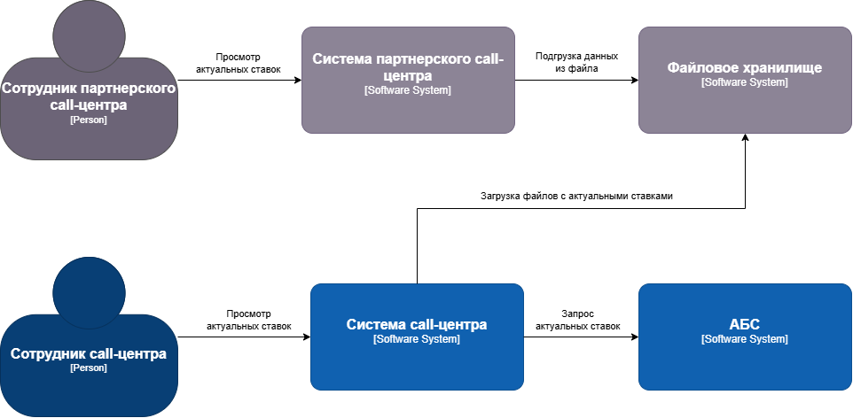
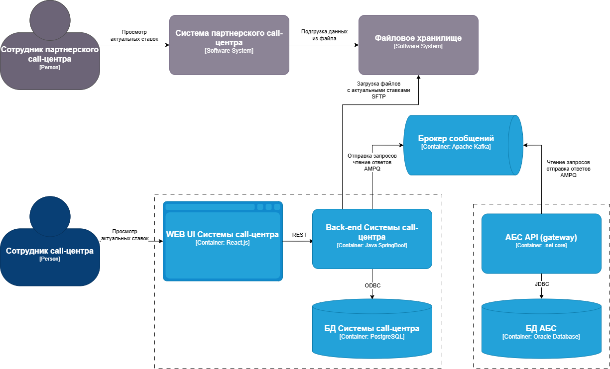
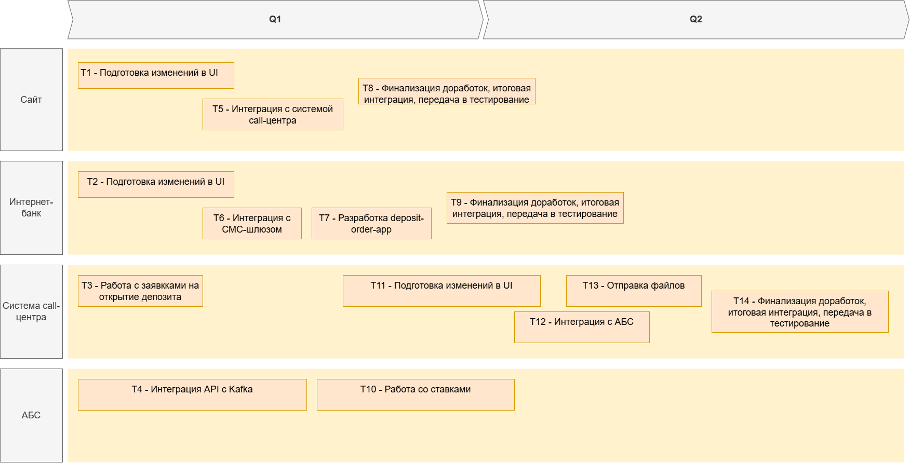

### **Название задачи: Передача ставок в call-центр** 
### **Автор: -**
### **Дата: 22.06.2025**
### **Функциональные требования**

|**№**|**Действующие лица или системы**|**Use Case**|**Описание**|
| :-: | :- | :- | :- |
| UC1 | Сотрудник call-центра  Система call-центра  АБС | Просмотр ставок сотрудником call-центра | 1. Сотрудник call-центра запрашивает актуальные ставки.  2. Система call-центра запрашивает актуальные ставки в АБС  3. Система отображает список актуальных ставок, полученный от АБС. |
| UC2 | Система call-центра  Хранилище файлов в партнерском call-центре | Передача актуальных ставок партнерскому call-центру | Процедура запускается с согласованной с бизнесом периодичностью (обычно раз в день)  1. Система call-центра запрашивает актуальные ставки в АБС.  2. Система формирует файл с актуальными ставками для передачи в партнерский call-центр.  3. Система отправляет файл, например, через SFTP-протокол. |

### **Нефункциональные требования**

|**№**|**Требование**|
| :-: | :- |
| R   | Надёжность (Reliability)           |
| R1  | Все сервисы должны работать 24/7   |
| R2  | Все сервисы должны быть доступны в 99,9% случаев |
| P   | Производительность (Performance)   |
| P1  | Отклик по всем операциям должен быть максимально быстрым и занимать миллисекунды |
| +R  | + Ограничения (Restrictions)       |
| +R1 | При доработках во всех системах нужно как можно больше использовать технологии, которые уже есть в банке |
| +S  | + Требования к безопасности (Security)       |
| +S1 | Данные при передаче необходимо защитить механизмом шифрования | |

### **Решение**
Диаграмма контекста:

Диаграмма контейнеров:

Принятые решения:
1. Функционал работы со ставками целесообразно реализовать в АБС, т.к. такие сведения могут быть важны для дальнейшей автоматизации бизнес-процессов и цифровой трансформации
2. Интеграцию системы call-центра и АБС осуществить через асинхронный API, разработанный в рамках задачи "Открытие депозитов онлайн" (согласно начальному описанию система call-центра и АБС уже интегрированы для заявок на открытие депозитов)
3. Добавить в систему call-центра функционал по экспорту текущих ставок в файлы и периодической их отправке партнерам

### **Альтернативы**
1. Разработка отдельного микросервиса для работы со ставками. Отклонена ввиду несоразмерности с масштабом решаемой задачи.
2. Синхронная интеграция системы call-центра и АБС. Отклонена ввиду критичности нагрузки на АБС.
3. Автоматизация отправки файла со ставками из АБС. Отклонена ввиду перегрузки АБС несвойственным функционалом.

**Недостатки, ограничения, риски**

Основные недостатки - необходимость значительных доработок.
Доработка АБС может занять продолжительное время.
Доработка системы call-центра затруднена тем, что в команде АБС не так много специалистов с опытом в Java-стеке.
Помимо этого, интеграция с АБС будет возможна только после реализации асинхронного API.

### RoadMap

